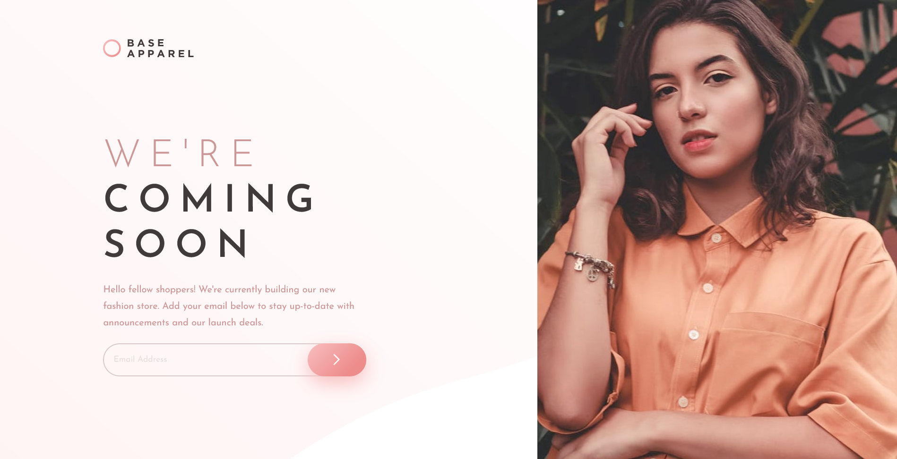
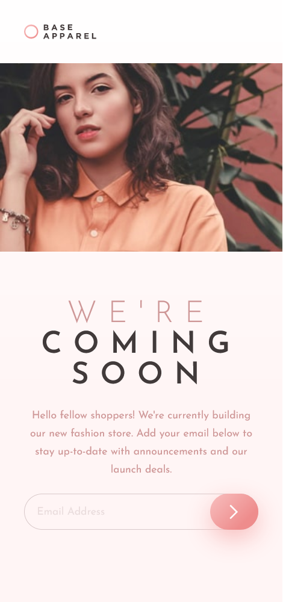
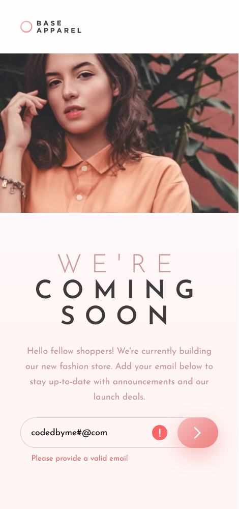

# Frontend Mentor - Base Apparel coming soon page solution

This is a solution to the [Base Apparel coming soon page challenge on Frontend Mentor](https://www.frontendmentor.io/challenges/base-apparel-coming-soon-page-5d46b47f8db8a7063f9331a0). Frontend Mentor challenges help you improve your coding skills by building realistic projects. 

## Table of contents

- [Overview](#overview)
  - [The challenge](#the-challenge)
  - [Screenshot](#screenshot)
  - [Links](#links)
- [My process](#my-process)
  - [Built with](#built-with)
  - [What I learned](#what-i-learned)
  - [Continued development](#continued-development)
  - [Useful resources](#useful-resources)
- [Author](#author)

## Overview

### The challenge

Users should be able to:

- View the optimal layout for the site depending on their device's screen size
- See hover states for all interactive elements on the page
- Receive an error message when the `form` is submitted if:
  - The `input` field is empty
  - The email address is not formatted correctly

### Screenshot

- Desktop




- Mobile

<p align="center">
  
  
</p>

### Links

- Solution URL: [Add solution URL here](https://your-solution-url.com)
- Live Site URL: [Github Page](https://lonelyknight2902.github.io/base-apparel-coming-soon/dist/)

## My process

### Built with

- HTML5
- CSS custom properties
- Flexbox
- Mobile-first workflow
- SASS
- Vanilla Javascript

### What I learned

After finishing the project, I am finally able to learn how to use SASS to improve my performance in styling as well as responsive design for mobile and desktop screen size.

- Variables in SCSS
```scss
$desaturated-red: hsl(0, 36%, 70%);
$dark-grayish-red: hsl(0, 6%, 24%);
$lightgray: hsl(356,18%,82%);
$gradient1: hsl(0, 0%, 100%);
$gradient2: hsl(0, 100%, 98%);
$light-gradient2: hsl(0, 73%, 90%);
$gradient3: hsl(0, 80%, 86%);
$gradient4: hsl(0, 74%, 74%);
$error: hsl(0,65%,65%);
$angle: 135deg;
```
- Add Event listener in Javascript
```js
form.addEventListener("submit", (e) => {
    e.preventDefault();
    if(!re.test(document.forms["submit"]["email"].value)) {
        msg.style.display = "block";
        icon.style.display = "flex";
    } else {
        msg.style.display = "none";
        icon.style.display = "none";
    }
})
```

### Continued development


### Useful resources

- [Interneting is hard](https://www.internetingishard.com) - This beginner-friendly website for web development provides useful knowledge and great visualization which helped me understand the basic concept of HTML and CSS with ease.
- [Sass Tutorial for Beginners - CSS With Superpowers by freeCodeCamp](https://www.youtube.com/watch?v=_a5j7KoflTs&t=252s&pp=ugMICgJ2aRABGAE%3D) - This is an amazing 2 hours video on SASS which helped me finally understand how to use SASS to improve my coding. Recommended for beginners.

## Author

- Github - [lonelyknight2902](https://github.com/lonelyknight2902)
- Frontend Mentor - [@lonelyknight2902](https://www.frontendmentor.io/profile/lonelyknight2902)
- Linkedin - [Trường Thịnh Đỗ](www.linkedin.com/in/trường-thịnh-đỗ-418616209)